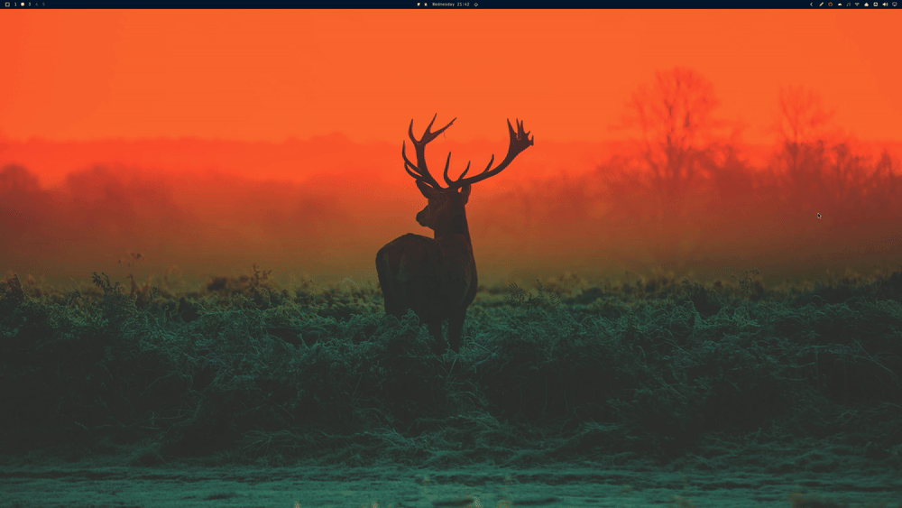
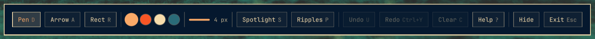
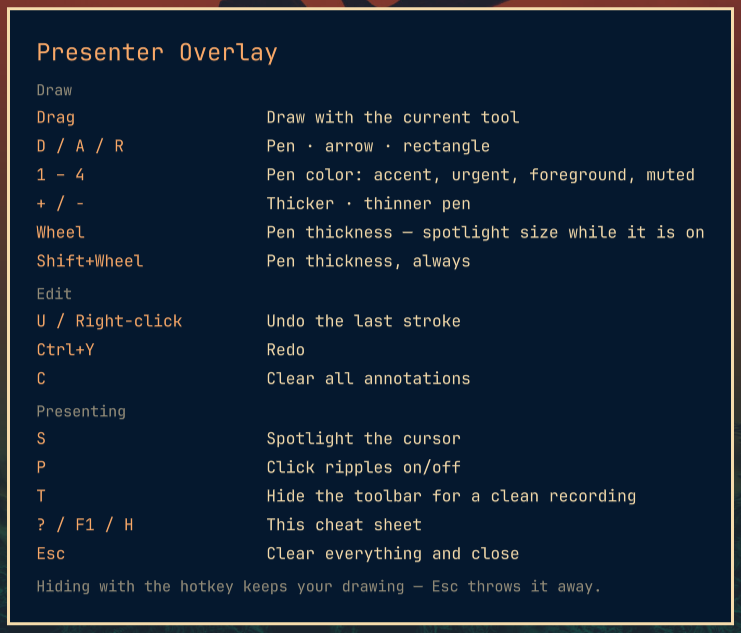

# Presenter Overlay for Omarchy

**Draw on your screen, spotlight your cursor, and highlight your clicks — a
shell overlay built for demos, screencasts and screen sharing.**

[](LICENSE)

Click the pencil in your bar, and the whole screen becomes a whiteboard on top
of whatever you are presenting. Circle the button you are talking about, drop
an arrow on it, dim everything but the spot you want people looking at — then
hit `Exit` and it is all gone.




## Features

- **A button in your bar** — left click draws, right click spotlights, middle
  click wipes the last drawing. No keybinding to set up and nothing to
  memorise; bind a hotkey later only if you want one.
- **Annotate anything** — freehand pen, arrows and rectangles, drawn straight
  over your desktop, browser, terminal or slides.
- **Four theme-aware pens** — the colors come from the active Omarchy theme
  (accent, urgent, foreground, muted), so the overlay never clashes with it.
- **Spotlight** — dim the screen except a circle around the pointer, sized with
  the scroll wheel.
- **Click ripples** — an expanding ring at every click, so a recording shows
  where you actually clicked.
- **Undo / redo / clear** — including right-click to undo without moving your
  hand off the mouse.
- **Toolbar you can hide** — every piece of state is visible at the bottom of
  the screen and clickable, and `T` hides it for a clean recording.

  

- **Built-in cheat sheet** — `?` at any time; it also shows itself the first
  time you open the overlay.

  

## Requirements

- Omarchy 4 (Quattro) or newer, running `omarchy-shell`.

## Install

```bash
omarchy plugin add https://github.com/andreas-bylund/presenter-overlay.git --enable
```

That clones the plugin into
`~/.config/omarchy/plugins/bylund.presenter-overlay/` and enables it. The shell
picks it up without a restart.

To remove it again:

```bash
omarchy plugin disable bylund.presenter-overlay
omarchy plugin remove bylund.presenter-overlay
```

## The bar button

Presenter Overlay installs as two things at once: the overlay itself, and a
pencil button for your bar. Enabling the plugin puts the button on the right of
the bar; drag it wherever you like, or place it explicitly:

```bash
omarchy plugin enable bylund.presenter-overlay left --after omarchy.workspaces
```

| Click | What happens |
|---|---|
| Left | Opens the overlay with the pen selected |
| Right | Opens it with the spotlight on |
| Middle | Clears the annotations without opening anything |

The button turns your theme's urgent color while the overlay is up.

Because the overlay covers the whole screen — the bar included — the button
cannot be clicked a second time to put it away. Use `Hide` in the overlay's own
toolbar to park the drawing so the same button brings it back, or `Exit` (`Esc`)
to throw it away.

## Set up a keybinding (optional)

The bar button is the whole interface, but a hotkey is faster mid-demo.
Presenter Overlay ships none of its own, so bind it wherever it fits your muscle
memory.

Omarchy 4 configures Hyprland through Lua. Add this to
`~/.config/hypr/bindings.lua`:

```lua
o.bind("SUPER + ALT + D", "Draw on screen", "omarchy-shell shell toggle bylund.presenter-overlay")
o.bind("SUPER + ALT + P", "Spotlight cursor", [[omarchy-shell shell summon bylund.presenter-overlay '{"mode":"spotlight"}']])
```

On an older setup that still reads `~/.config/hypr/bindings.conf`, plain
Hyprland syntax works too:

```conf
bind = SUPER ALT, D, exec, omarchy-shell shell toggle bylund.presenter-overlay
```

Both of those are free on a stock Omarchy install. Watch out for the neighbours
if you pick your own: `SUPER + SHIFT + D` opens Docker, and `SUPER + ALT + S`
moves a window to the scratchpad.

## Keymap

| Key | Action |
| --- | --- |
| Drag | Draw with the current tool |
| `D` / `A` / `R` | Pen · arrow · rectangle |
| `1` – `4` | Pen color: accent, urgent, foreground, muted |
| `+` / `-` (or `]` / `[`) | Thicker / thinner pen |
| Wheel | Pen thickness — or spotlight size while the spotlight is on |
| `Shift`+Wheel | Pen thickness, always |
| `U` or right-click | Undo the last stroke |
| `Ctrl`+`Y` (or `Ctrl`+`Shift`+`Z`) | Redo |
| `C` | Clear all annotations |
| `S` | Toggle the spotlight |
| `P` | Toggle click ripples |
| `T` | Toggle the toolbar |
| `?` / `F1` / `H` | Cheat sheet |
| `Esc` | Clear everything and close |

Every one of these has a chip in the toolbar too, plus two that are mouse-only:
`Hide` and `Exit`.

Hiding the overlay — the `Hide` chip, the bar button, or your hotkey — **keeps**
the drawing, so you can bring the same annotations back. `Exit` / `Esc` is the
one that throws it away.

## Summon payloads

`summon` and `toggle` accept an optional JSON payload, which is how you bind
more than one entry point to the same overlay:

```jsonc
{
  "mode": "spotlight", // "draw" (default) or "spotlight" — spotlight also turns on ripples
  "tool": "arrow"      // "pen" (default), "arrow" or "rect"
}
```

```bash
omarchy-shell shell summon bylund.presenter-overlay '{"mode":"spotlight"}'
omarchy-shell shell summon bylund.presenter-overlay '{"tool":"arrow"}'
```

Sending a payload to an overlay that is already open switches mode without
touching what you have already drawn.

## Scripting it

A few actions are callable from the outside while the overlay is loaded, which
is useful for stream-deck style bindings:

```bash
omarchy-shell shell call bylund.presenter-overlay toggleSpotlight ""
omarchy-shell shell call bylund.presenter-overlay toggleRipples ""
omarchy-shell shell call bylund.presenter-overlay clearAnnotations ""
omarchy-shell shell call bylund.presenter-overlay setTool arrow
```

## Theming

Presenter Overlay hardcodes no colors. Pens, scrim, toolbar and cheat sheet all
read the `Color` and `Style` singletons the rest of the shell uses, so switching
your Omarchy theme restyles the overlay with it. The four pens map to the
foundational theme roles — a theme with a strong accent gets a pen to match.

Strokes remember the color they were drawn in, so a theme switch mid-session
leaves existing annotations alone.

## Known limitations

- **One screen at a time.** The overlay is a single layer-shell surface, so on a
  multi-monitor setup it covers the screen the compositor puts it on.
- **Share the whole monitor, not an application window.** Window sharing only
  captures the selected application surface, so a separate layer-shell overlay
  cannot appear in that stream.
- **Click ripples only show clicks on the overlay.** While Presenter Overlay is
  open it takes keyboard and pointer input, so the apps underneath do not
  receive clicks. A global click visualizer that keeps working while you use
  your apps would need a separate input-listening service.

The cheat sheet opens once after installation. That state is stored in
`$XDG_STATE_HOME/omarchy/presenter-overlay.json` (or
`~/.local/state/omarchy/presenter-overlay.json`) so shell restarts do not show
it again.

## Development

Plugins are discovered in `~/.config/omarchy/plugins/<id>/` and hot-reload when
a file is saved.

That covers the bar widget, which picks up an edit within a second or two. It
does **not** cover the overlay: `keepLoaded: true` keeps its component mounted
for the whole shell session, so the watcher logs the reload but the running
overlay keeps the code it started with. Editing anything the overlay draws
means `omarchy-restart-shell`.

Clone straight into the plugin directory. Do **not** develop in a checkout
elsewhere and symlink it in: the plugin loads fine that way, but the shell's
file watcher does not follow the symlink, so nothing hot-reloads and every edit
needs a restart to show up.

```bash
git clone https://github.com/andreas-bylund/presenter-overlay.git \
  ~/.config/omarchy/plugins/bylund.presenter-overlay
omarchy plugin enable bylund.presenter-overlay

# Check the manifest against the same rules the shell enforces
omarchy plugin validate ~/.config/omarchy/plugins/bylund.presenter-overlay

# Toggle it
omarchy-shell shell toggle bylund.presenter-overlay
```

If you want it alongside your other projects, point the symlink the other way —
the real files stay where the watcher can see them:

```bash
ln -s ~/.config/omarchy/plugins/bylund.presenter-overlay ~/Projects/presenter-overlay
```

Load errors show up on the `omarchy-shell` console as
`panel plugin bylund.presenter-overlay failed to load: …`, and widget errors as
`Plugin widget bylund.presenter-overlay failed: …`. Read them with:

```bash
journalctl --user --since -5min | grep presenter-overlay
```

Hot-reload handles edits to a file, but replacing the plugin directory itself —
or changing `kinds` in the manifest — can leave Qt holding a stale compiled
component, which surfaces as a bogus `File name case mismatch`. Restart the
shell to clear it:

```bash
omarchy-restart-shell
```

Layout:

```
manifest.json                  Plugin manifest (schemaVersion 1, kinds
                               "overlay" + "bar-widget")
PresenterOverlay.qml           Overlay entry point: window, state, key routing
PresenterOverlayWidget.qml     Bar entry point: the pencil button
components/DrawLayer.qml       Stroke model and the two drawing canvases
components/SpotlightLayer.qml
components/ClickRipples.qml
components/Toolbar.qml         Bottom pill
components/ToolbarChip.qml
components/HelpOverlay.qml     Cheat sheet
```

## Contributing

Issues and pull requests are welcome. Keep QML in the style of the surrounding
code and of the Omarchy shell itself: two-space indent, no semicolons, theme
tokens instead of literal colors.

## License

[MIT](LICENSE) © Andreas Bylund
